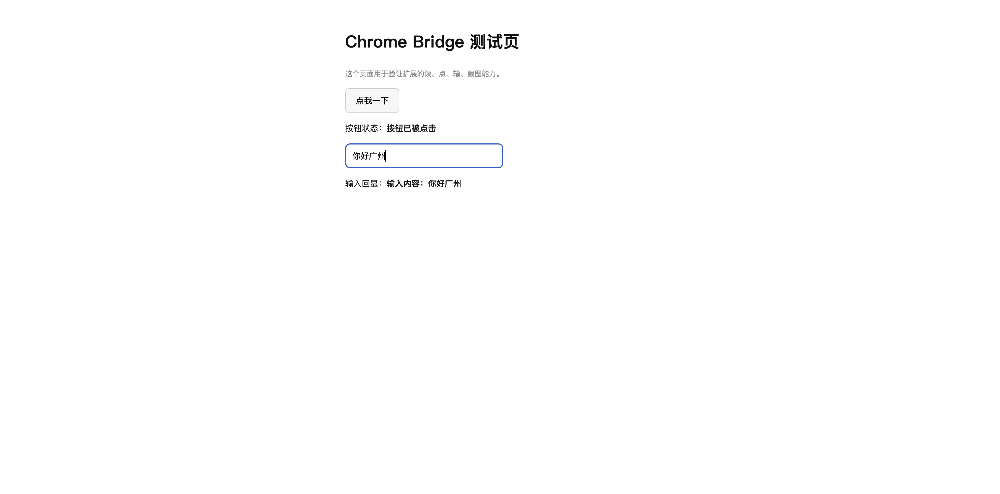

# Chrome Bridge for AI Agents

**Give your AI agent a real browser — with your real logins.**

Chrome Bridge lets a local AI agent drive the Chrome you're already signed into: read pages,
click, type, scroll, screenshot, run arbitrary JavaScript, or send raw CDP commands.
Because the extension runs *inside your browser*, every request carries **your own cookies** —
so pages behind a login (X/Twitter, internal dashboards, SaaS consoles) just work.

No cloud service. No API keys. No cookie export. Everything stays on `127.0.0.1`.

[中文说明 →](README.zh-CN.md) · [详细使用文档 (中文)](docs/usage.zh-CN.md) · [Detailed usage](docs/usage.md)

---

## Why

Most browser-automation setups fail on the one thing that matters: **you're not logged in.**

- Headless scrapers hit a login wall.
- Public mirrors of social sites are dead or behind bot protection.
- Exporting cookies is fragile, and leaks credentials into files.
- `--remote-debugging-port` is ignored on Chrome's default profile since Chrome 136.

Chrome Bridge sidesteps all of it. The extension lives in your normal browser profile and
dials *out* to a tiny local bridge server, which the agent talks to over HTTP.

## Architecture

```
┌─────────────┐   HTTP    ┌──────────────────┐   WebSocket   ┌──────────────────┐   CDP   ┌─────────┐
│  AI Agent   │ ────────▶ │  Bridge Server   │ ◀──────────── │ Chrome Extension │ ──────▶ │  Tabs   │
│  (cb CLI)   │  127.0.0.1│  (zero-dep Node) │  127.0.0.1    │   (MV3, SW)      │         │         │
└─────────────┘   :8777   └──────────────────┘    /ext       └──────────────────┘         └─────────┘
```

- **Bridge Server** (`server/bridge.mjs`) — HTTP endpoint for commands, WebSocket endpoint for
  the extension. Binds to loopback only. Validates the WebSocket `Origin` so ordinary web pages
  can never connect. 15-second heartbeat drops dead extension connections.
- **Chrome Extension** (`extension/`) — Manifest V3 service worker. Connects out to the bridge
  and executes commands via `chrome.debugger` (the Chrome DevTools Protocol).
- **CLI** (`cli/cb.mjs`) — the agent-facing entry point.
- **`server/ws-lite.mjs`** — a minimal RFC 6455 WebSocket server. The whole project has
  **zero npm dependencies**.

### Why CDP instead of `chrome.scripting`?

`chrome.debugger` gives capabilities plain content scripts can't:

| Capability | Why it matters |
|---|---|
| `Runtime.evaluate` | Not subject to the page's CSP — no `unsafe-eval` problems |
| `Input.dispatchMouseEvent` / `insertText` | Emits **trusted** events, so sites with interaction checks still respond |
| `Page.captureScreenshot` | Real screenshots, including full-page |
| Full CDP passthrough | Anything Chrome DevTools can do, the agent can do |

## Quick start

**Requirements:** Node.js 18+ (22+ recommended) and Google Chrome.

### 1. Start the bridge

```bash
git clone https://github.com/peterxulove/chrome-bridge-for-ai-agent.git
cd chrome-bridge-for-ai-agent
./start-bridge.sh          # starts on 127.0.0.1:8777, idempotent
```

### 2. Load the extension

Chrome 137+ removed `--load-extension`, so this is a **one-time manual step**:

1. Open `chrome://extensions`
2. Turn on **Developer mode** (top right)
3. Click **Load unpacked**
4. Select the `extension/` folder from this repo

The extension's service worker connects to the bridge automatically. Click the extension icon
to see connection status and your tab IDs.

### 3. Verify

```bash
node cli/cb.mjs health     # → extensionConnected: true
node cli/cb.mjs tabs       # list your tabs with their IDs
```

### 4. Use it

```bash
node cli/cb.mjs open https://example.com     # → { "tabId": 1234, ... }
node cli/cb.mjs text 1234                    # read the page
node cli/cb.mjs snapshot 1234                # list interactive elements as @refs
node cli/cb.mjs click 1234 @e3               # real mouse click
node cli/cb.mjs type 1234 @e7 "hello" --submit
node cli/cb.mjs shot 1234 page.png --full    # screenshot
```

## Command reference

| Command | Description |
|---|---|
| `cb health` | Bridge and extension connection status |
| `cb tabs` | List all tabs (with `tabId`) |
| `cb open <url>` | Open a new tab and wait for load; returns `tabId` |
| `cb info <tabId>` | URL / title / status of a tab |
| `cb goto <tabId> <url>` | Navigate an existing tab |
| `cb text <tabId> [selector]` | Visible text |
| `cb html <tabId> [selector]` | HTML source |
| `cb snapshot <tabId>` | Interactive elements with `@ref` handles and coordinates |
| `cb click <tabId> <selector\|@ref>` | Real mouse click |
| `cb type <tabId> <selector\|@ref> <text> [--submit]` | Focus and type |
| `cb scroll <tabId> [y]` | Scroll by pixels |
| `cb shot <tabId> [out.png] [--full] [--jpeg]` | Screenshot to file |
| `cb eval <tabId> <js>` | Evaluate JS in the page |
| `cb cdp <tabId> <Method> [json]` | Send any CDP command |
| `cb raw <cmd> [jsonArgs]` | Send any bridge command |

Add `--json` to any command for the raw response. See [docs/usage.md](docs/usage.md) for
detailed usage, worked examples, and troubleshooting.

## Use as a WorkBuddy skill

This repo doubles as a self-contained [agent skill](skill/SKILL.md). To install it into
WorkBuddy AI:

```bash
./install.sh     # copies to ~/.workbuddy-ai/skills/chrome-bridge/
```

The skill teaches an agent when and how to reach for the browser, plus the hard-won details
of scraping login-gated sites.

## Security model

- The bridge **binds to `127.0.0.1` only** — never exposed to your network.
- The WebSocket handshake **validates `Origin`** and accepts only `chrome-extension://`.
  A malicious web page that guesses the port still can't connect.
- The extension **reads no cookies and sends nothing anywhere**. There is no telemetry,
  no external endpoint, and no dependency to compromise.
- Optional shared-secret auth via the `CB_TOKEN` environment variable.
- The `debugger` permission is broad by necessity — it's what allows trusted input events and
  CSP-free evaluation. Read [docs/security.md](docs/security.md) before deploying on a
  shared machine.

## Known limitations

- **`chrome://` pages can't be debugged.** Chrome blocks it. You'll get `debugger_attach_failed`.
- **DevTools must be closed** on a tab before attaching to it.
- A "Chrome is being debugged" infobar appears on tabs while attached. That's Chrome, not us.
- **Background tabs are throttled** — scrolling a tab opened with `active: false` won't load
  new content. Use foreground tabs for anything that lazy-loads.
- **`--load-extension` no longer works** (Chrome 137+), including the
  `--disable-features=DisableLoadExtensionCommandLineSwitch` escape hatch. Manual load only.

## Development

```bash
node tests/test-bridge.mjs      # bridge protocol, timeouts, heartbeats, Origin checks (no Chrome needed)
node tests/test-extension.mjs   # extension logic against a stubbed chrome API + fake DOM
node tests/e2e.mjs              # real browser end-to-end (extension must be loaded)
```

`test-extension.mjs` runs the real `background.js` inside a Node `vm` context with a fake
`chrome` object, so command routing and generated-expression bugs surface without a browser.
`e2e.mjs` drives an actual Chrome tab: opens a fixture page, clicks a button, types into an
input, and verifies the page's own event handlers fired.



## License

[MIT](LICENSE)
